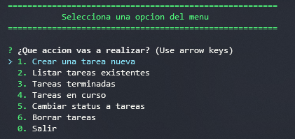

<div align="center"> 
  
</div>
<div> 
  <h1 align="center">Manager</h1>
  <p>
    Aplicación simple que permite administrar tareas, con una interfaz
    sencilla y agradable para uso personal. Al ser una aplicación de consola, la navegación  pretende ser simple. 
  </p>
</div>

## Requisitos

* [NodeJs][node] v14.15.5 o superior
* [npm][npm] v6.14.11 o superior

## Configuración

Para hacer uso de este proyecto es necesario clonarlo y seguir los siguientes pasos.

```shell
git clone https://github.com/GustavoHdezH/Manager.git
cd Manager
npm install
nmp run manager
```
## Practica
Para usar la apliación solo se requiere del teclado.
<div align="center"> 
  
</div>

### Manejo de tareas
* Para una tarea solo se debe desplazar a la opción **numero 1**, si el campo esta vacio, la aplicación no dejara avanzar hasta que tenga algo de información.
*  Para conocer el estado de las tareas, se debe de seleccionar la opción **numero 2** para listarlas sin importar el estado de la misma.
* Para listar las tareas que fueron terminadas y muestra la fecha, en la que se termino. Se debe seleccionar la **opción 3**.
* Para listar solo las tareas que estan en curso, se debe seleccionar la **opción 4**.
* Para cambiar el estado de las tareas, se debe seleccionar la **opción 5**. Solo existen dos estados, **In Progress** y **Complete**.
* Para borrar las tareas que no seran de utilidad en el futuro, se debe seleccionar la **opción 6**. 
* Para salir de la consola y terminar la aplicación, se debe seleccionar la **opción 7**.


## Adicional

* [colors][colors] dependencia para la apariencia
* [inquirer][inquirer] dependencia para la navegación


<!-- Inicio de enlaces de este documento -->
[npm]: https://www.npmjs.com/
[node]: https://nodejs.org
[colors]: https://www.npmjs.com/package/colors
[inquirer]: https://www.npmjs.com/package/inquirer
<!-- Fin de enlaces de este documento -->